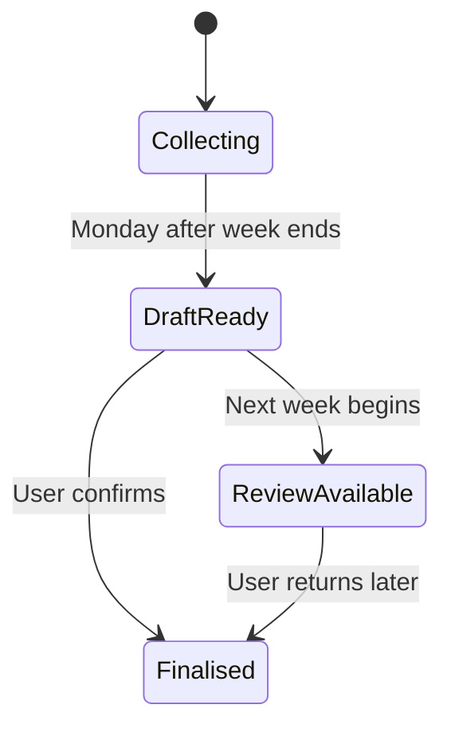

# Outset Ready V1 product brief

**Date:** 3 September 2026  
**Status:** Approved product direction; implementation pending

## 1. Proposition

Outset Ready helps you see whether your current actions and existing plans support the health, fitness and adventure goals you care about.

Its core question is:

> Does what I’m doing still fit where I want to go?

Ready treats the user’s chosen goal as important because the user values it. It connects goals, plans and evidence, then offers a calm read of progress and one useful adjustment.

## 2. Product hypotheses

V1 will test these hypotheses:

- A user gains more value from connected interpretation than from another dashboard of isolated health metrics.
- A weekly review provides enough perspective to avoid reacting to daily noise.
- A lightweight Week in Progress view helps the user understand the current plan without creating daily judgement.
- Goal stacking helps the user manage competing priorities better than a single-goal tracker.
- Users want help assessing an existing plan more than they want another plan generator.

## 3. V1 boundary

| V1 includes | V1 excludes |
| --- | --- |
| Personal, single-user product proof | Public multi-user launch |
| Health, fitness and adventure goals | Finance, career, language and generic habit goals |
| A prioritised stack of current, supporting and future goals | An algorithm that changes goal priority without consent |
| Garmin as the preferred connector | Strava, Apple Health, COROS and other connectors |
| Manual evidence and plan edits | Garmin-only operation |
| Weekly review and Week in Progress | Daily verdicts and streak mechanics |
| Rules-based calculations with one cached AI interpretation | AI processing for every interaction |
| Optional calories, protein and alcohol context | A calorie or nutrition tracker |
| Assessment of an existing plan | Training-plan generation and workout prescription |
| Responsive desktop-first web experience | Native phone application |
| Email review and user-selected reminders | Adaptive nudging and missed-workout nagging |
| Data structures for events and activities | A searchable, verified event catalogue |
| The real reference goal stack described below | A claim that Ready can assess every possible goal |

V1 must remain useful when AI fails, Garmin fails or the user omits optional context.

## 4. Reference journey and acceptance case

V1 will prove the product against one real goal stack:

1. **Current priority:** reach 85 kg.
2. **Supporting goal:** maintain strength and training consistency.
3. **Future priority:** prepare for Ultra Mirage El Djerid 50 km.

Ready may explain that a health goal supports a later adventure goal, but it must state dependencies with care. Weight loss, for example, may reduce the load carried while running, but poor fuelling or lost strength could undermine training.

The end-to-end journey is:

1. The user creates the goal stack.
2. The user connects Garmin or begins with manual evidence.
3. Ready imports the intended plan, records completed work and preserves plan changes.
4. Ready prepares a weekly draft after Sunday.
5. The user checks optional context and confirms the review.
6. Ready calculates each goal read, generates one compact interpretation and recommends one adjustment.

## 5. Goal model

### 5.1 Goal categories

V1 recognises three categories:

- **Health**, such as reaching a target weight.
- **Fitness**, such as maintaining strength or running consistency.
- **Adventure**, such as preparing for Ultra Mirage or climbing Mont Blanc.

V1 can allow custom goals within these categories. The reference journey only proves the templates and evidence needed for the three selected goals.

### 5.2 Two-stage creation

**Stage one** asks for:

- goal name;
- category;
- optional target date.

**Stage two** adds detail when Ready needs it:

- definition of the outcome;
- existing plan;
- current capability;
- relevant evidence;
- relationship to other goals.

Ready uses **Building a picture** until the goal has enough core evidence for a responsible assessment.

### 5.3 Priorities and relationships

The user assigns one current priority. Other goals can support the current priority or wait as scheduled future priorities.

Ready can explain that one goal:

- supports another;
- constrains another;
- competes for the same time or recovery capacity.

The user keeps final control. Ready can propose a different ordering and explain why, but it cannot change priorities without confirmation.

A future handover can have a planned date. Ready asks the user to confirm the handover rather than changing it silently.

### 5.4 Evidence templates

Ready provides a default evidence template for each goal. The user can:

- keep a signal;
- mark it irrelevant;
- mark it unavailable;
- add another relevant signal.

This approach gives Outset a place to encode useful expertise while preserving the user’s context.

## 6. Evidence model

### 6.1 Sources

Ready prefers Garmin for V1 and accepts manual evidence when Garmin lacks a signal or fails.

Each evidence item should preserve:

- source;
- observed time;
- value or completion state;
- available confidence or quality context;
- whether the user supplied or corrected it.

The goal engine must consume Ready’s evidence model rather than Garmin-specific fields. This boundary allows later connectors without rewriting goal logic.

### 6.2 Required and optional evidence

Each goal template defines its core evidence. Missing core evidence can produce **Building a picture**.

These inputs remain optional across the product:

- calories;
- protein;
- alcohol;
- waist measurements;
- contextual notes.

Missing optional evidence stays unknown. Ready must not convert missing values to zero or block a review.

### 6.3 Manual input

The home screen can offer quick structured additions for:

- activity or workout;
- waist measurement;
- calories or protein;
- alcohol;
- other goal evidence.

Ready should favour structured choices over free-text AI interpretation. A manual activity remains valid evidence, although an imported activity may provide richer detail.

## 7. Plans, calendar and adherence

### 7.1 Plan sources

V1 uses this order:

1. Garmin Calendar, including workouts that other services place there.
2. Manual additions and edits.
3. A saved weekly template when no calendar plan exists.

Ready snapshots imported plan items locally so later calendar changes do not erase the plan the user intended to follow.

### 7.2 Revisions

Ready keeps a revision history for moved, changed, skipped and removed work.

It judges the week against the latest intentional plan. It also examines repeated reductions or skips across several weeks, because repeated changes may reveal a mismatch between the plan and the user’s life.

One moved or skipped workout should not trigger a negative judgement.

### 7.3 Structured reasons

The user can add an optional reason when moving, changing or skipping planned work:

- schedule;
- recovery;
- soreness or illness;
- travel;
- weather;
- motivation;
- plan changed.

V1 does not spend AI tokens interpreting free-text explanations.

## 8. Weekly experience

### 8.1 Two cadences

- **Week in Progress:** a lightweight view of planned work, completed work, changes and patterns worth noticing.
- **Weekly review:** the considered goal assessment and one recommended change.

Ready should avoid daily goal verdicts because daily fluctuations can create noise and unnecessary pressure.

### 8.2 Review lifecycle

Ready prepares a rules-based draft on Monday after the Sunday close. The user checks imported work, optional inputs and plan changes before confirming.

If the user does not confirm:

- the new week starts normally;
- the earlier review remains available without expiry;
- imported measurements and activities still contribute to longer trends;
- optional missing data remains unknown;
- Ready does not call the AI;
- Ready preserves the goal priorities and plan context that applied to that week.

The home screen can show a quiet note such as: **You have one earlier weekly review available.**

## 9. Goal assessment

### 9.1 User-facing states

Ready uses four non-judgemental states:

- **Progressing:** current evidence supports movement towards the goal.
- **Mixed signals:** useful signals point in different directions.
- **Review the plan:** a repeated pattern suggests that the user should reconsider plan fit or execution.
- **Building a picture:** Ready lacks core evidence for a responsible read.

Ready must not use **ON_TRACK**, **WATCH**, **OFF_TRACK** or **INSUFFICIENT** in the user interface.

### 9.2 Layered explanation

Each goal shows one summary state. The user can expand it to inspect:

- recent direction;
- plan follow-through;
- remaining goal gap;
- evidence and unknowns that shaped the read.

The home screen gives the current priority the main position. Supporting and future goals appear as compact cards or accordions.

### 9.3 Weekly output

The completed review contains:

- a state for each active goal;
- a concise overall read;
- what supported progress;
- the main pattern worth attention;
- one recommended change;
- a short, non-judgemental closing line.

Ready should call out repeated plan reductions or skipped work with language such as: **You have changed or skipped several planned sessions recently. Keep an eye on whether the plan still fits your week.**

## 10. AI boundary and cost control

Normal application code calculates:

- trends;
- adherence;
- plan revisions;
- repeated patterns;
- status candidates;
- missing evidence;
- structured weekly facts.

Ready sends one compact structured summary to AI only after the user confirms the weekly review. It caches the response against a hash of the inputs and does not regenerate it unless those inputs change.

If the AI service fails or the user disables it, Ready still displays the rules-based assessment.

V1 has no paid tiers. We can evaluate pricing, quotas and external-user AI costs after the product proves useful.

## 11. Home screen

The desktop home screen prioritises:

1. Current goal, summary state and one action.
2. Supporting and future goals as compact expandable cards.
3. Week in Progress.
4. One coach observation.
5. Quick add for optional evidence.
6. A quiet earlier-review reminder when relevant.

The first responsive version should remain usable at phone widths. A later phone companion can focus on today, this week, quick entry, move or skip actions and reminders.

## 12. Reminders

V1 uses email for:

- weekly review ready;
- one optional follow-up for an unconfirmed review;
- a user-selected goal-priority handover;
- user-selected event milestones and preparation dates;
- a connector problem that prevents expected evidence from arriving.

Ready should not send streak emails, missed-workout messages or escalating overdue warnings. V1 does not attempt adaptive behavioural nudging.

## 13. Events and the Outset ecosystem

### 13.1 Event model

The V1 data model distinguishes:

- **Known event:** a dated edition, such as Ultra Mirage El Djerid 2027.
- **Known activity:** a reusable objective, such as climbing Mont Blanc.
- **Personal event:** a user-created race, trip or challenge.

A goal can link to one of these records. V1 can use manually entered requirements before Outset supplies a verified catalogue.

### 13.2 Later catalogue

A later Outset catalogue can provide:

- dates and locations;
- capability requirements;
- environmental factors;
- preparation milestones;
- readiness templates;
- links into Outset Prepare and Outset Kit.

### 13.3 Data-driven possibilities

Outset can later match a user’s evidence to catalogue entries. The product should present these as possibilities rather than prescriptions.

Ready can provide:

- an Explore catalogue that the user opens;
- at most one restrained home-screen possibility when evidence supports it;
- the reason for the match;
- supporting evidence and important unknowns;
- **Dismiss** and **Not for me** controls.

Ready should not repeat a rejected possibility. It should avoid saying that the user is ready until a full assessment supports that conclusion.

## 14. Migration and architecture constraints

We will choose the application stack after inspecting the existing WL repository.

The implementation should:

- bring across the proven Garmin importer, SQLite model, calculations and tests;
- place Garmin behind a connector boundary;
- model goals, evidence, plans, reviews and events as Ready concepts;
- keep the existing WL dashboard running until Ready reaches functional parity;
- retain static HTML export as a fallback if it remains useful;
- avoid any runtime dependency on the WL repository.

## 15. V1 acceptance criteria

V1 counts as complete when it can:

- create and prioritise the three-goal reference stack;
- schedule and confirm a future priority handover;
- import body composition, recovery, activities and calendar plans from Garmin;
- accept manual activities, plan changes and optional context;
- preserve imported plan snapshots and revision history;
- show a responsive Week in Progress;
- prepare a Monday review draft;
- distinguish core missing evidence from optional missing context;
- calculate a transparent state for each goal;
- show recent direction, plan follow-through and remaining gap;
- allow late finalisation of any earlier review;
- make one cached AI call after confirmation and provide a rules-only fallback;
- send the agreed email reminders;
- remain usable on desktop and at phone widths;
- demonstrate that weight, training consistency and Ultra Mirage can coexist in one goal stack.

## 16. Later scope

Later phases can add:

- a verified event and activity catalogue;
- readiness templates for more adventures;
- data-driven goal possibilities;
- Outset Prepare and Outset Kit hand-offs;
- additional connectors such as Strava, Apple Health and COROS when demand supports them;
- a native phone companion;
- multi-user accounts and paid tiers after validation.